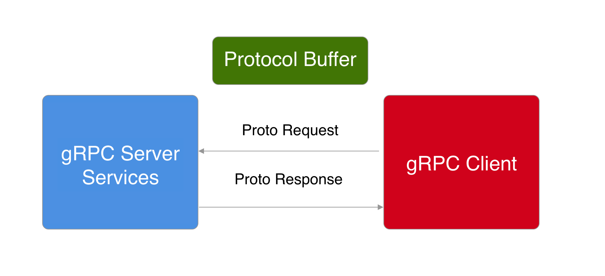

= Websockets, gRPC and more
:revealjs_theme: white
:revealjs_controls: false
:revealjs_progress: false
:customcss: custom.css

by Gabriel Aigner

== Websockets

=== Websockets Use Cases

* Live Chat (Support-Chats)
* Social Media Live Feed
* Multiplayer Gaming

=== When to use Websockets?

* Fast Reaction Time
* Ongoing Updates

=== How Do Websockets Work?

== SSE

Server-sent Events

=== SSE Use Cases

* Social Media Live Feed
* Notifications to browser
* Stock ticker streaming

=== Why use SSE?

* transported over simple HTTP instead of a custom protocol
* built in support for re-connection

=== How Do SSE Work?

image::img/sse.jpg[]

== gRPC

gRPC Remote Procedure Calls

=== gRPC Use Cases

* Internet Of Things
* internal microservice communication
* energy efficient systems

=== Why use gRPC?

* built on HTTP/2, supports traditional Request/Response model and bidirectional streams
* because of the binary data format, it is very lightweight

=== How Does gRPC Work?

== Webhooks

=== How Do Webhooks Work?

[.source-link]
Image source: http://brianyang.com/working-with-webhooks/

== Sources

[.source-slide]
https://sookocheff.com/post/networking/how-do-websockets-work/

[.source-slide]
https://youtu.be/2Nt-ZrNP22A

[.source-slide]
https://quarkus.io/guides/websockets

[.source-slide]
https://www.baeldung.com/java-ee-jax-rs-sse

[.source-slide]
https://youtu.be/4HlNv1qpZFY

[.source-slide]
https://youtu.be/qQLVCgmiMgQ

[.source-slide]
https://www.youtube.com/watch?v=Yw4rkaTc0f8&t=154s

[.source-slide]
https://dzone.com/articles/why-grpc-for-inter-microservice-communication

[.source-slide]
https://quarkus.io/guides/grpc-getting-started

[.source-slide]
http://brianyang.com/working-with-webhooks/

[.source-slide]
https://dev.to/alokkumarsbg/webhook-or-reverse-api-37o1

== Websockets, gRPC and more

by Gabriel Aigner

[.source-slide]
Slides und examples: 
[.source-slide]
https://github.com/gabrielaigner/websockets-grpc-and-more